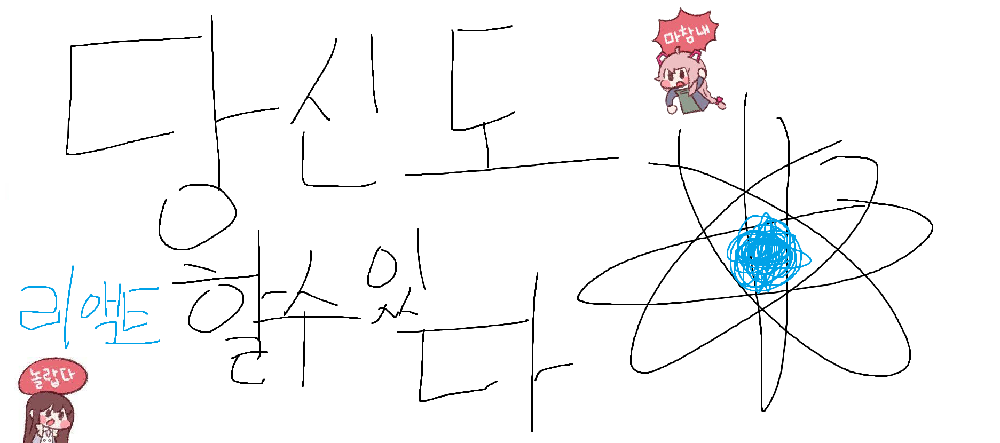
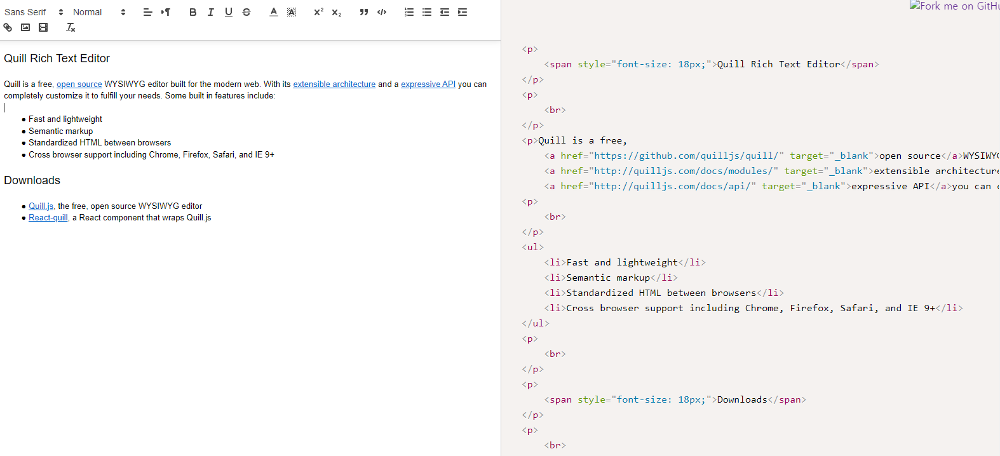
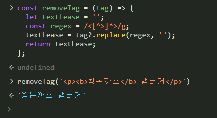

# 글자형으로 받은 html 태그 제거하기


<br />
<br />
<br />

작업내용중 react-quill 라이브러리를 사용해, 게시글을 작성하는 내용이 있다.

quill 라이브러리를 사용하면



위 사진과 같이 작성한 내용이 html 코드로 변환된다. 이 값을 사용하는대 있어 문제가 발생했다.
<br />
<br />
<br />

## html 태그 제거

내가 필요한부분은 html 태그를 제외한 일반 글자들이다.

예를 들어 `<p><b>왕돈까스</b> 햄버거</p>` 이런 코드가 있다면 `왕돈까스 햄버거` 이렇게 글자형만 필요한것이다.

그렇기에 태그를 제거하는 함수를 하나 만들었다.

```js
export const removeTag = (tag) => {
  let textLease = "";
  const regex = /<[^>]*>/g;
  textLease = tag?.replace(regex, "");
  return textLease;
};
```



실행결과는 예상과 같이 태그를 제거한 후 글자형만 출력하였다.<br />
이로써 태그는 정상적으로 제거가 된 모습이다.

하지만 곧바로 문제가 생겼다.
태그 뿐만 아니라 각종 기호가 문제가 생겼다.
<br />
<br />

### 새로운 문제

```
왕 햄버거 돈까스는 정말 맛있어요

◇ 주말 점심으로 >> 맛있다 ! <<

◇ 햄버거 어떤가요 ?!
```

이런 내용의 글을 작성하면
<br />
<br />


```
"<p>왕 햄버거 돈까스는 정말 맛있어요</p><p><span class="ql-size-large">◇ 주말 점심으로 &gt;&gt; 맛있다 ! &lt;&lt; </span></p><p><span class="ql-size-large">◇ 햄버거 어떤가요 ?!</span></p>"
```

이런식의 글자형이 생긴다. 여기서 태그를 제거해도 `&gt; , &lt; ` 와 같은 특수문자도 따로 제거를 해 줘야하는 번거로움이 생긴다.

이런 문제가 생기고 이것은 비효율적이며 다른 로직을 생각해야한다고 판단했다.
<br />
<br />
<br />

## DOMParser()

찾던도중 `DOMParser()` 메서드를 발견하였고, 이 메서드는 <br />
문자형 형태의 html을 파싱해 DOM 으로 변환시키는 js 메서드이다.

이 값을 사용하여 함수를 재정리하였다.

```js
export const removeTag = (tag) => {
  const doc = new DOMParser().parseFromString(tag, "text/html");
  return doc.body.textContent.replace(/\s+/g, " ").trim();
};
```

실행 결과 값은 내가 원했던, 문자열 형태로 나오고, 따로 특수문자를 필터링 할 필요도 없어졌다.
